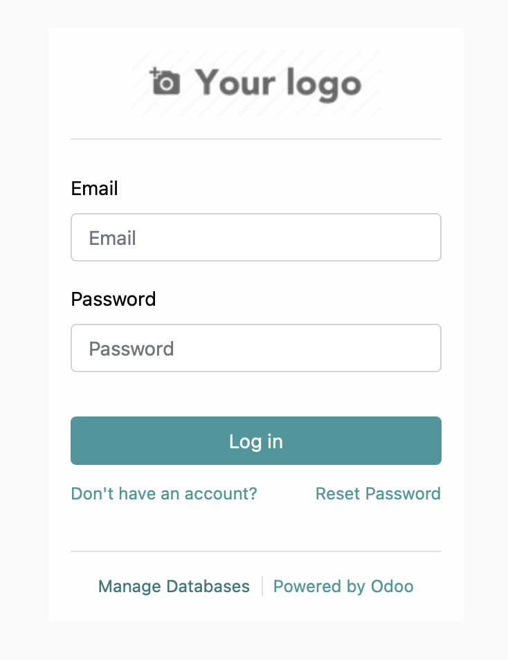
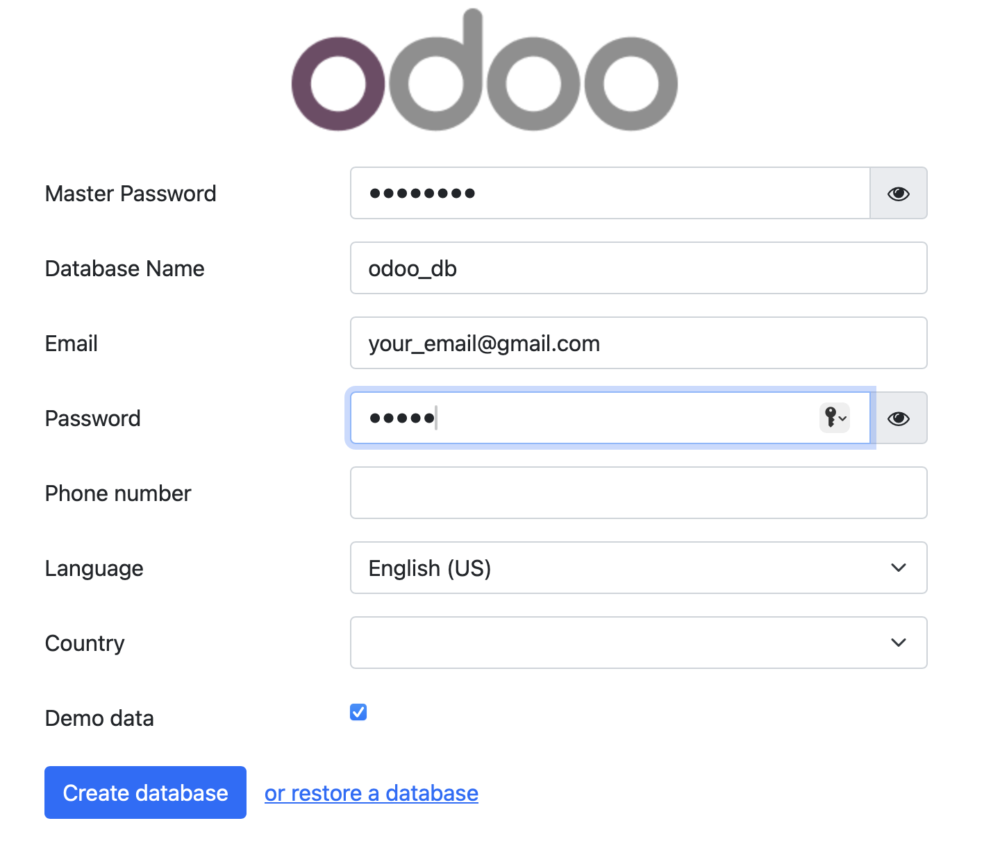
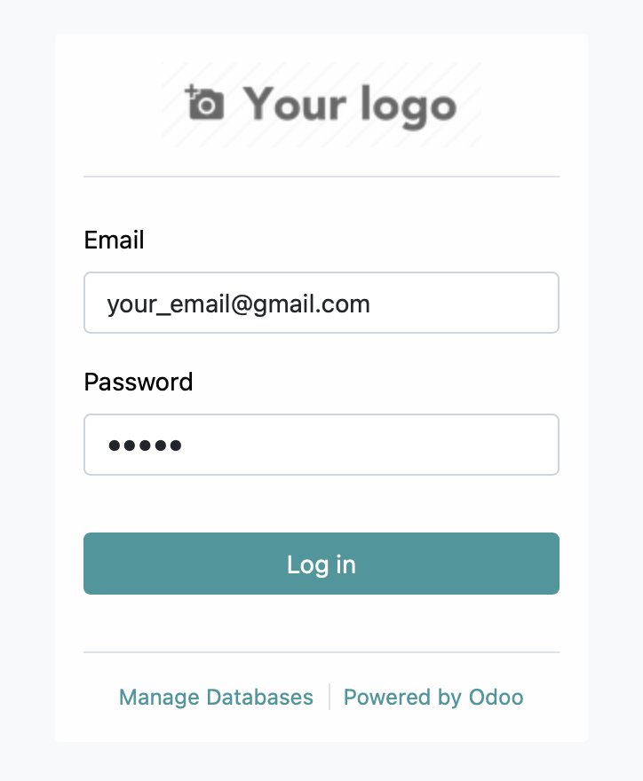
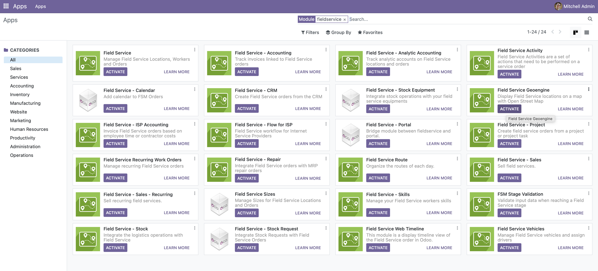
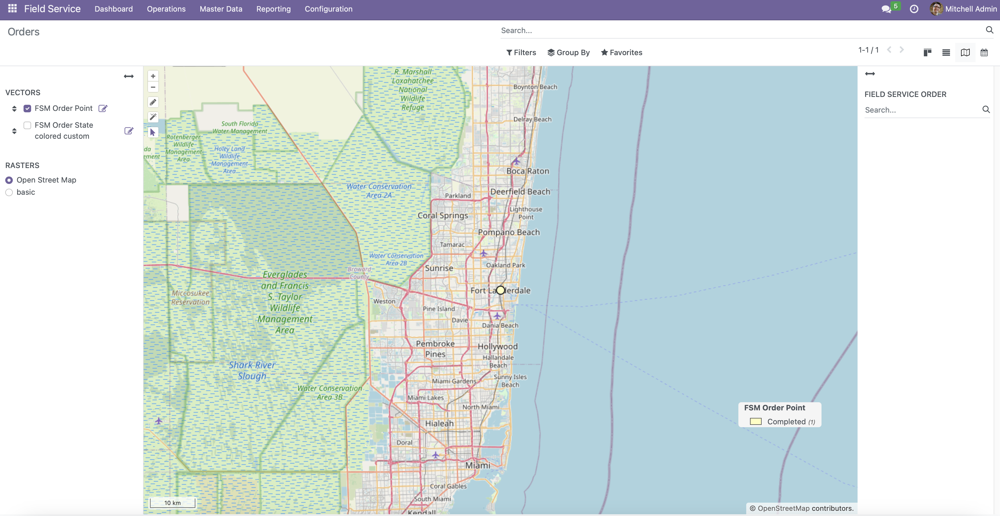

# Odoo GIS

This project integrates GIS functionality into Odoo.

## Features
- Spatial data handling within Odoo
- Map-based visualization
- Customizable GIS modules

## Prerequisites
- Docker needs to be installed and running on your system.

## Installation and Usage
1. Clone the repository
   ```bash
   git clone https://github.com/scvetojevic1402/odoo-gis
   ```
2. Run the project
   ```bash
   make run
   ```

## Using Odoo GIS

After running the project with `make run`, follow these steps to use Odoo GIS:

1. **Start Screen**
   Open your web browser and navigate to `http://localhost:8069`. Then click on `Manage Databases`.
   

2. **Create a Database**
   Fill out the form. Use your master password from odoo.conf, your email, odoo_db as the database name and choose your password. Also check `Demo Data` option.
   

3. **Login**
   Use your email and password from the previous step to log in. You will be redirected to the Odoo dashboard.
   

4. **Install GIS Modules**
   Search for the GIS-related modules, such as Field Service Geoengine and Field Service - CRM. Click on the "Activate" button to install them.
   

5. **Use GIS Features**
   Use the provided modules to manage geospatial data directly in Odoo. You can now create, view, and edit spatial data.
   